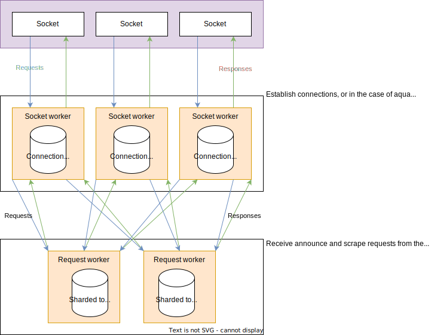
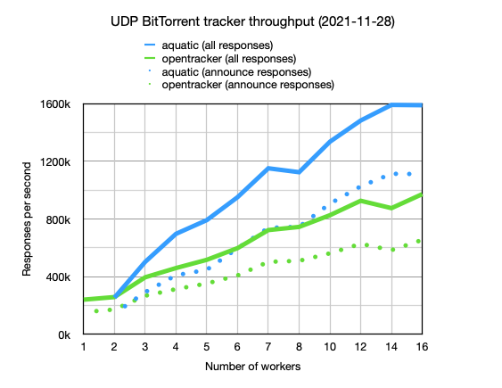

# aquatic: high-performance open BitTorrent tracker

[](https://github.com/greatest-ape/aquatic/actions/workflows/cargo-build-and-test.yml) [](https://github.com/greatest-ape/aquatic/actions/workflows/test-transfer.yml)

High-performance open BitTorrent tracker, consisting
of sub-implementations for different protocols:

[BitTorrent over UDP]: https://libtorrent.org/udp_tracker_protocol.html
[BitTorrent over HTTP]: https://wiki.theory.org/index.php/BitTorrentSpecification#Tracker_HTTP.2FHTTPS_Protocol
[WebTorrent]: https://github.com/webtorrent
[rustls]: https://github.com/rustls/rustls
[native-tls]: https://github.com/sfackler/rust-native-tls
[mio]: https://github.com/tokio-rs/mio
[glommio]: https://github.com/DataDog/glommio

| Name         | Protocol                                   | OS requirements              |
|--------------|--------------------------------------------|------------------------------|
| aquatic_udp  | [BitTorrent over UDP]                      | Unix-like (using [mio])      |
| aquatic_http | [BitTorrent over HTTP] with TLS ([rustls]) | Linux 5.8+ (using [glommio]) |
| aquatic_ws   | [WebTorrent] over TLS ([rustls])           | Linux 5.8+ (using [glommio]) |

Features at a glance:

- IPv4 and IPv6 support
- Optional access control (info hash filtering)
- Built-in TLS support (HTTP and WebTorrent protocols)
- Multithreaded design for handling large amounts of traffic
- All data is stored in-memory, so there is no need to configure a database

## Usage

### Prerequisites

- Install Rust with [rustup](https://rustup.rs/) (stable is recommended)
- Install cmake with your package manager (e.g., `apt-get install cmake`)
- Clone this git repository and enter it

### Compiling

Compile the implementations that you are interested in:

```sh
# Tell Rust to enable support for all CPU extensions present on current CPU
# except for those relating to AVX-512. This is necessary for aquatic_ws and
# recommended for the other implementations.
. ./scripts/env-native-cpu-without-avx-512

cargo build --release -p aquatic_udp
cargo build --release -p aquatic_http
cargo build --release -p aquatic_ws
```

### Running

Unless you're planning to only run `aquatic_udp`, make sure locked memory
limits are sufficient. You can do this by adding the following lines to
`/etc/security/limits.conf`, and then logging out and back in:

```
*    hard    memlock    512
*    soft    memlock    512
```

Generate configuration files. They come with comments and differ between protocols.

```sh
./target/release/aquatic_udp -p > "aquatic-udp-config.toml"
./target/release/aquatic_http -p > "aquatic-http-config.toml"
./target/release/aquatic_ws -p > "aquatic-ws-config.toml"
```

Make adjustments to the files. You will likely want to adjust `address`
(listening address) under the `network` section.

Note that both `aquatic_http` and `aquatic_ws` require configuring TLS
certificate and private key files. More details are available in the
respective configuration files.

Once done, run the tracker:

```sh
./target/release/aquatic_udp -c "aquatic-udp-config.toml"
./target/release/aquatic_http -c "aquatic-http-config.toml"
./target/release/aquatic_ws -c "aquatic-ws-config.toml"
```

### Configuration values

Starting more `socket_workers` than `request_workers` is recommended. All
implementations are quite IO-bound and spend a lot of their time reading from
and writing to sockets. This is handled by the socket workers, which
also do parsing, serialisation and access control. They pass announce and
scrape requests to the request workers, which update internal tracker state
and pass back responses for sending.

#### Access control

Access control by info hash is supported for all protocols. The relevant part
of configuration is:

```toml
[access_list]
# Access list mode. Available modes are allow, deny and off.
mode = "off"
# Path to access list file consisting of newline-separated hex-encoded info hashes.
path = ""
```

The file is read on start and when the program receives `SIGUSR1`. If initial
parsing fails, the program exits. Later failures result in in emitting of
an error-level log message, while successful updates of the access list result
in emitting of an info-level log message.

## Architectural overview



## Details on implementations

### aquatic_udp: UDP BitTorrent tracker

[BEP 015]: https://www.bittorrent.org/beps/bep_0015.html

Implements:
  * [BEP 015]: UDP BitTorrent tracker protocol ([more details](https://libtorrent.org/udp_tracker_protocol.html)). Exceptions:
    * Doesn't care about IP addresses sent in announce requests. The packet
      source IP is always used.
    * Doesn't track the number of torrent downloads (0 is always sent). 
  
IPv4 and IPv6 peers are tracked separately.

This is the most mature of the implementations. I consider it ready for production use.

#### Performance



More details are available [here](./documents/aquatic-udp-load-test-2021-11-28.pdf).

#### Optimisation attempts that didn't work out

* Using glommio
* Using io-uring
* Using zerocopy + vectored sends for responses
* Using sendmmsg

### aquatic_http: HTTP BitTorrent tracker

[BEP 003]: https://www.bittorrent.org/beps/bep_0003.html
[BEP 007]: https://www.bittorrent.org/beps/bep_0007.html
[BEP 023]: https://www.bittorrent.org/beps/bep_0023.html
[BEP 048]: https://www.bittorrent.org/beps/bep_0048.html

Implements:
  * [BEP 003]: HTTP BitTorrent protocol ([more details](https://wiki.theory.org/index.php/BitTorrentSpecification#Tracker_HTTP.2FHTTPS_Protocol)). Exceptions:
    * Only runs over TLS
    * Doesn't track the number of torrent downloads (0 is always sent)
    * Only compact responses are supported
  * [BEP 023]: Compact HTTP responses
  * [BEP 007]: IPv6 support
  * [BEP 048]: HTTP scrape support. Notes:
    * Doesn't allow full scrapes, i.e. of all registered info hashes

IPv4 and IPv6 peers are tracked separately.

`aquatic_http` has not been tested as much as `aquatic_udp` but likely works
fine.

### aquatic_ws: WebTorrent tracker

Aims for compatibility with [WebTorrent](https://github.com/webtorrent)
clients. Notes:

  * Only runs over TLS
  * Doesn't track the number of torrent downloads (0 is always sent). 
  * Doesn't allow full scrapes, i.e. of all registered info hashes

IPv4 and IPv6 peers are tracked separately.

`aquatic_ws` has not been tested as much as `aquatic_udp` but likely works
fine.

## Load testing

There are load test binaries for all protocols. They use a CLI structure
similar to the trackers and support generation and loading of configuration
files.

To run, first start the tracker that you want to test. Then run the
corresponding load test binary:

```sh
./scripts/run-load-test-udp.sh
./scripts/run-load-test-http.sh
./scripts/run-load-test-ws.sh
```

To fairly compare HTTP performance to opentracker, set keepalive to false in
`aquatic_http` settings.

## Copyright and license

Copyright (c) 2020-2022 Joakim Frostegård

Distributed under Apache 2.0 license (details in `LICENSE` file.)

## Trivia

The tracker is called aquatic because it thrives under a torrent of bits ;-)
