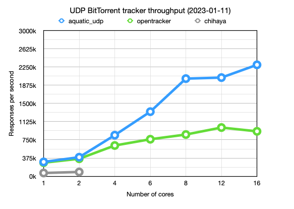

# aquatic: high-performance open BitTorrent tracker

High-performance open BitTorrent tracker, consisting
of sub-implementations for different protocols:

[aquatic_udp]: ./crates/udp
[aquatic_http]: ./crates/http
[aquatic_ws]: ./crates/ws

| Name           | Protocol                        | OS requirements |
|----------------|---------------------------------|-----------------|
| [aquatic_udp]  | BitTorrent over UDP             | Unix-like       |
| [aquatic_http] | BitTorrent over HTTP over TLS   | Linux 5.8+      |
| [aquatic_ws]   | WebTorrent, optionally over TLS | Linux 5.8+      |

Features at a glance:

- Multithreaded design for handling large amounts of traffic
- All data is stored in-memory (no database needed)
- IPv4 and IPv6 support
- Supports forbidding/allowing info hashes
- Prometheus metrics
- Automated CI testing of full file transfers

Known users:

- [explodie.org public tracker](https://explodie.org/opentracker.html) (`udp://explodie.org:6969`), typically [serving ~80,000 requests per second](https://explodie.org/tracker-stats.html)

## Performance of the UDP implementation

More benchmark details are available [here](./documents/aquatic-udp-load-test-2023-01-11.pdf).

## Usage

Please refer to the README pages for the respective implementations listed in
the table above.

## Architectural overview

## Copyright and license

Copyright (c) 2020-2023 Joakim Frostegård

Distributed under the terms of the Apache 2.0 license. Please refer to the
`LICENSE` file in the repository root directory for details.

## Trivia

The tracker is called aquatic because it thrives under a torrent of bits ;-)
