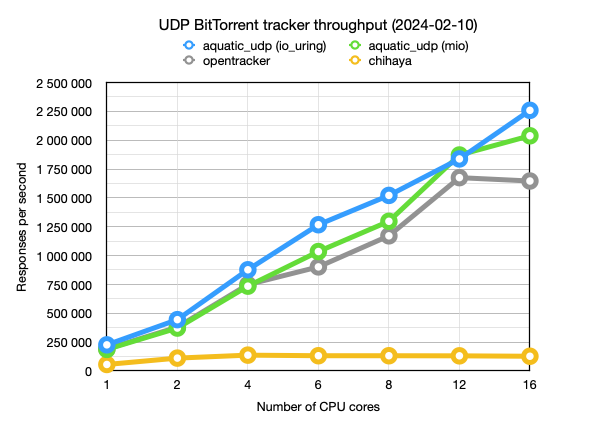

# aquatic: high-performance open BitTorrent tracker

High-performance open BitTorrent tracker, consisting
of sub-implementations for different protocols:

[aquatic_udp]: ./crates/udp
[aquatic_http]: ./crates/http
[aquatic_ws]: ./crates/ws

| Name           | Protocol                                  | OS requirements    |
|----------------|-------------------------------------------|--------------------|
| [aquatic_udp]  | BitTorrent over UDP                       | Unix-like          |
| [aquatic_http] | BitTorrent over HTTP, optionally over TLS | Linux 5.8 or later |
| [aquatic_ws]   | WebTorrent, optionally over TLS           | Linux 5.8 or later |

Features at a glance:

- Multithreaded design for handling large amounts of traffic
- All data is stored in-memory (no database needed)
- IPv4 and IPv6 support
- Supports forbidding/allowing info hashes
- Prometheus metrics
- Automated CI testing of full file transfers

Known users:

- [explodie.org public tracker](https://explodie.org/opentracker.html) (`udp://explodie.org:6969`), typically [serving ~100,000 requests per second](https://explodie.org/tracker-stats.html)
- [tracker.webtorrent.dev](https://tracker.webtorrent.dev) (`wss://tracker.webtorrent.dev`)

## Performance of the UDP implementation

More benchmark details are available [here](./documents/aquatic-udp-load-test-2024-02-10.md).

## Usage

Please refer to the README pages for the respective implementations listed in
the table above.

## Auxiliary software

There are also some auxiliary applications and libraries.

### Tracker load testing

Load test applications for aquatic and other trackers, useful for profiling:

- [aquatic_udp_load_test](./crates/udp_load_test/) - BitTorrent over UDP
- [aquatic_http_load_test](./crates/http_load_test/) - BitTorrent over HTTP
- [aquatic_ws_load_test](./crates/ws_load_test/) - WebTorrent

Automated benchmarking of aquatic and other trackers: [aquatic_bencher](./crates/bencher/)

### Client ⇄ tracker communication

Libraries for communication between clients and trackers:

- [aquatic_udp_protocol](./crates/udp_protocol/) - BitTorrent over UDP
- [aquatic_http_protocol](./crates/http_protocol/) - BitTorrent over HTTP
- [aquatic_ws_protocol](./crates/ws_protocol/) - WebTorrent

### Other

- [aquatic_peer_id](./crates/peer_id/) - extract BitTorrent client information
  from peer identifiers

## Copyright and license

Copyright (c) Joakim Frostegård

Distributed under the terms of the Apache License, Version 2.0. Please refer to
the `LICENSE` file in the repository root directory for details.

## Trivia

The tracker is called aquatic because it thrives under a torrent of bits ;-)
