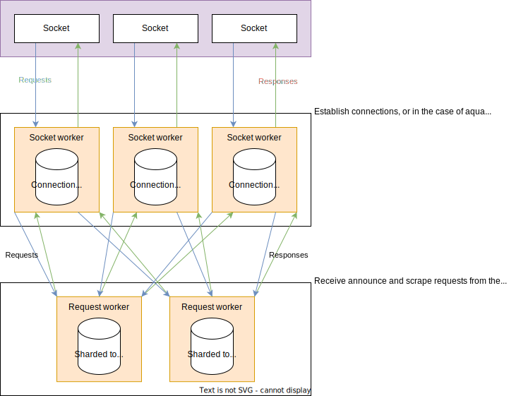

# aquatic: high-performance open BitTorrent tracker

[](https://github.com/greatest-ape/aquatic/actions/workflows/cargo-build-and-test.yml) [](https://github.com/greatest-ape/aquatic/actions/workflows/test-transfer.yml)

High-performance open BitTorrent tracker, consisting
of sub-implementations for different protocols:

[BitTorrent over UDP]: https://libtorrent.org/udp_tracker_protocol.html
[BitTorrent over HTTP]: https://wiki.theory.org/index.php/BitTorrentSpecification#Tracker_HTTP.2FHTTPS_Protocol
[WebTorrent]: https://github.com/webtorrent
[rustls]: https://github.com/rustls/rustls
[native-tls]: https://github.com/sfackler/rust-native-tls
[mio]: https://github.com/tokio-rs/mio
[glommio]: https://github.com/DataDog/glommio

| Name         | Protocol                                   | OS requirements              |
|--------------|--------------------------------------------|------------------------------|
| aquatic_udp  | [BitTorrent over UDP]                      | Unix-like (using [mio])      |
| aquatic_http | [BitTorrent over HTTP] with TLS ([rustls]) | Linux 5.8+ (using [glommio]) |
| aquatic_ws   | [WebTorrent] over TLS ([rustls])           | Linux 5.8+ (using [glommio]) |

Features at a glance:

- Multithreaded design for handling large amounts of traffic
- All data is stored in-memory (no database needed)
- IPv4 and IPv6 support, with separate swarms
- Supports forbidding/allowing info hashes
- Built-in TLS support (no reverse proxy needed)
- Automated CI testing of full file transfers

Known users:

- [explodie.org public tracker](https://explodie.org/opentracker.html) (`udp://explodie.org:6969`), typically serving ~100,000 requests per second 

## Usage

### Compiling

- Install Rust with [rustup](https://rustup.rs/) (latest stable release is recommended)
- Install cmake with your package manager (e.g., `apt-get install cmake`)
- Clone this git repository and enter the directory
- Build the implementations that you are interested in:

```sh
# Tell Rust to enable support for all CPU extensions present on current CPU
# except for those relating to AVX-512. This is necessary for aquatic_ws and
# recommended for the other implementations.
. ./scripts/env-native-cpu-without-avx-512

cargo build --release -p aquatic_udp
cargo build --release -p aquatic_http
cargo build --release -p aquatic_ws
```

### Configuring

Generate configuration files. They come with comments and differ between protocols.

```sh
./target/release/aquatic_udp -p > "aquatic-udp-config.toml"
./target/release/aquatic_http -p > "aquatic-http-config.toml"
./target/release/aquatic_ws -p > "aquatic-ws-config.toml"
```

Make adjustments to the files. You will likely want to adjust `address`
(listening address) under the `network` section.

Note that both `aquatic_http` and `aquatic_ws` require configuring TLS
certificate and private key files. More details are available in the
respective configuration files.

#### Workers

To increase performance, number of worker threads can be increased. The sum of
`socket_workers` and `request_workers` should equal the total number of CPU cores
that you want to use. Recommended proportions:

<table>
 <tr>
  <td></td>
  <th colspan="4">aquatic_udp</th>
  <th colspan="3">aquatic_ws</th>
 </tr>
 <tr>
  <th scope="row">CPU cores</th>
  <td>2-5</td>
  <td>6-9</td>
  <td>10-15</td>
  <td>>=16</td>
  <td>2-11</td>
  <td>12-19</td>
  <td>>=20</td>
 </tr>
 <tr>
  <th scope="row">Request workers</th>
  <td>1</td>
  <td>2</td>
  <td>3</td>
  <td>4</td>
  <td>1</td>
  <td>2</td>
  <td>3</td>
 </tr>
 <tr>
  <th scope="row">Socket workers</th>
  <td>1-4</td>
  <td>4-7</td>
  <td>7-12</td>
  <td>>=12</td>
  <td>1-10</td>
  <td>10-17</td>
  <td>>=17</td>
 </tr>
</table>

#### Access control

Access control by info hash is supported for all protocols. The relevant part
of configuration is:

```toml
[access_list]
# Access list mode. Available modes are allow, deny and off.
mode = "off"
# Path to access list file consisting of newline-separated hex-encoded info hashes.
path = ""
```

The file is read on start and when the program receives `SIGUSR1`. If initial
parsing fails, the program exits. Later failures result in in emitting of
an error-level log message, while successful updates of the access list result
in emitting of an info-level log message.

### Running

If you're running `aquatic_http` or `aquatic_ws`, please make sure locked memory
limits are sufficient:
- If you're using a systemd service file, add `LimitMEMLOCK=65536000` to it
- Otherwise, add the following lines to
`/etc/security/limits.conf`, and then log out and back in:

```
*    hard    memlock    65536
*    soft    memlock    65536
```

Once done, start the application:

```sh
./target/release/aquatic_udp -c "aquatic-udp-config.toml"
./target/release/aquatic_http -c "aquatic-http-config.toml"
./target/release/aquatic_ws -c "aquatic-ws-config.toml"
```

If your server is pointed to by domain `example.com` and you configured the
tracker to run on port 3000, people can now use it by adding its URL to their
torrent files or magnet links:

| Implementation | Announce URL                        |
|----------------|-------------------------------------|
| aquatic_udp    | `udp://example.com:3000`            |
| aquatic_http   | `https://example.com:3000/announce` |
| aquatic_ws     | `wss://example.com:3000`            |

## Details on implementations

### aquatic_udp: UDP BitTorrent tracker

[BEP 015]: https://www.bittorrent.org/beps/bep_0015.html

Implements:
  * [BEP 015]: UDP BitTorrent tracker protocol ([more details](https://libtorrent.org/udp_tracker_protocol.html)). Exceptions:
    * Doesn't care about IP addresses sent in announce requests. The packet
      source IP is always used.
    * Doesn't track the number of torrent downloads (0 is always sent). 

This is the most mature of the implementations. I consider it ready for production use.

#### Performance


More details are available [here](./documents/aquatic-udp-load-test-2021-11-28.pdf).

#### Optimisation attempts that didn't work out

* Using glommio
* Using io-uring
* Using zerocopy + vectored sends for responses
* Using sendmmsg

### aquatic_http: HTTP BitTorrent tracker

[BEP 003]: https://www.bittorrent.org/beps/bep_0003.html
[BEP 007]: https://www.bittorrent.org/beps/bep_0007.html
[BEP 023]: https://www.bittorrent.org/beps/bep_0023.html
[BEP 048]: https://www.bittorrent.org/beps/bep_0048.html

Implements:
  * [BEP 003]: HTTP BitTorrent protocol ([more details](https://wiki.theory.org/index.php/BitTorrentSpecification#Tracker_HTTP.2FHTTPS_Protocol)). Exceptions:
    * Only runs over TLS
    * Doesn't track the number of torrent downloads (0 is always sent)
    * Only compact responses are supported
  * [BEP 023]: Compact HTTP responses
  * [BEP 007]: IPv6 support
  * [BEP 048]: HTTP scrape support. Notes:
    * Doesn't allow full scrapes, i.e. of all registered info hashes

`aquatic_http` has not been tested as much as `aquatic_udp` but likely works
fine.

### aquatic_ws: WebTorrent tracker

Aims for compatibility with [WebTorrent](https://github.com/webtorrent)
clients. Notes:

  * Only runs over TLS
  * Doesn't track the number of torrent downloads (0 is always sent). 
  * Doesn't allow full scrapes, i.e. of all registered info hashes

`aquatic_ws` has not been tested as much as `aquatic_udp` but likely works
fine.

#### Performance


More details are available [here](./documents/aquatic-ws-load-test-2022-03-29.pdf).

## Load testing

There are load test binaries for all protocols. They use a CLI structure
similar to the trackers and support generation and loading of configuration
files.

To run, first start the tracker that you want to test. Then run the
corresponding load test binary:

```sh
./scripts/run-load-test-udp.sh
./scripts/run-load-test-http.sh
./scripts/run-load-test-ws.sh
```

To fairly compare HTTP performance to opentracker, set `keep_alive` to false in
`aquatic_http` settings.

## Architectural overview



## Copyright and license

Copyright (c) 2020-2022 Joakim Frostegård

Distributed under Apache 2.0 license (details in `LICENSE` file.)

## Trivia

The tracker is called aquatic because it thrives under a torrent of bits ;-)
