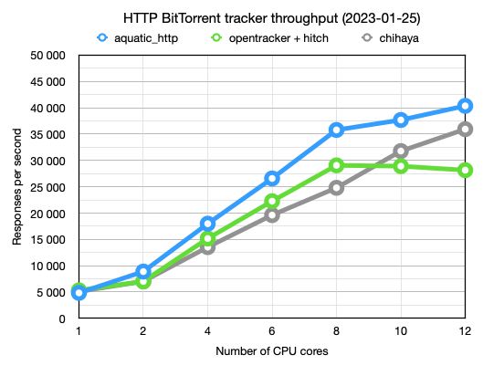

# aquatic_http: high-performance open HTTP BitTorrent tracker

[](https://github.com/greatest-ape/aquatic/actions/workflows/ci.yml)

High-performance open HTTP BitTorrent tracker for Linux 5.8 or later.

Features at a glance:

- Multithreaded design for handling large amounts of traffic
- All data is stored in-memory (no database needed)
- IPv4 and IPv6 support
- Supports forbidding/allowing info hashes
- Prometheus metrics
- Automated CI testing of full file transfers

## Performance



More benchmark details are available [here](../../documents/aquatic-http-load-test-2023-01-25.pdf).

## Usage

### Compiling

- Install Rust with [rustup](https://rustup.rs/) (latest stable release is recommended)
- Install build dependencies with your package manager (e.g., `apt-get install cmake build-essential`)
- Clone this git repository and build the application:

```sh
git clone https://github.com/greatest-ape/aquatic.git && cd aquatic

# Recommended: tell Rust to enable support for all SIMD extensions present on
# current CPU except for those relating to AVX-512. (If you run a processor
# that doesn't clock down when using AVX-512, you can enable those instructions
# too.)
. ./scripts/env-native-cpu-without-avx-512

cargo build --release -p aquatic_http
```

### Configuring

Generate the configuration file:

```sh
./target/release/aquatic_http -p > "aquatic-http-config.toml"
```

Make necessary adjustments to the file. You will likely want to adjust
listening addresses under the `network` section.

To run over TLS, configure certificate and private key files.

Running behind a reverse proxy is supported. Please refer to the config file
for details.

### Running

Make sure locked memory limits are sufficient:
- If you're using a systemd service file, add `LimitMEMLOCK=65536000` to it
- Otherwise, add the following lines to
`/etc/security/limits.conf`, and then log out and back in:

```
*    hard    memlock    65536
*    soft    memlock    65536
```

Once done, start the application:

```sh
./target/release/aquatic_http -c "aquatic-http-config.toml"
```

If your server is pointed to by domain `example.com` and you configured the
tracker to run on port 3000, people can now use it by adding the URL
`https://example.com:3000/announce` to their torrent files or magnet links.

### Load testing

A load test application is available. It supports generation and loading of
configuration files in a similar manner to the tracker application.

After starting the tracker, run the load tester:

```sh
. ./scripts/env-native-cpu-without-avx-512 # Optional

cargo run --release -p aquatic_http_load_test -- --help
```

## Details

[BEP 003]: https://www.bittorrent.org/beps/bep_0003.html
[BEP 007]: https://www.bittorrent.org/beps/bep_0007.html
[BEP 023]: https://www.bittorrent.org/beps/bep_0023.html
[BEP 048]: https://www.bittorrent.org/beps/bep_0048.html

Implements:
  * [BEP 003]: HTTP BitTorrent protocol ([more details](https://wiki.theory.org/index.php/BitTorrentSpecification#Tracker_HTTP.2FHTTPS_Protocol)). Exceptions:
    * Doesn't track the number of torrent downloads (0 is always sent)
    * Only compact responses are supported
  * [BEP 023]: Compact HTTP responses
  * [BEP 007]: IPv6 support
  * [BEP 048]: HTTP scrape support. Notes:
    * Doesn't allow full scrapes, i.e. of all registered info hashes

`aquatic_http` has not been tested as much as `aquatic_udp`, but likely works
fine in production.

## Architectural overview


## Copyright and license

Copyright (c) Joakim Frostegård

Distributed under the terms of the Apache License, Version 2.0. Please refer to
the `LICENSE` file in the repository root directory for details.
